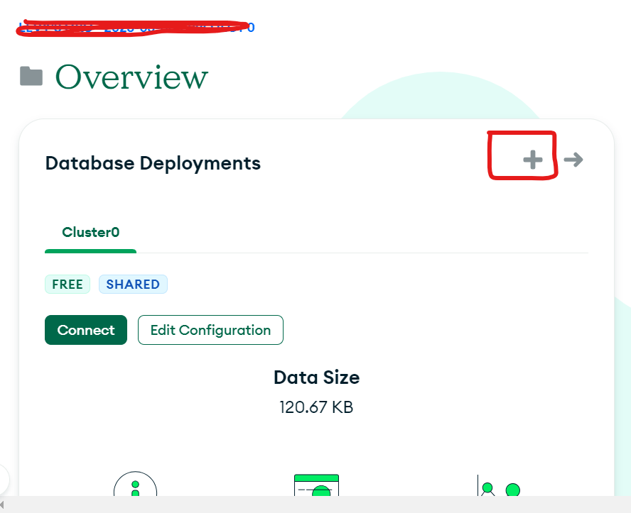
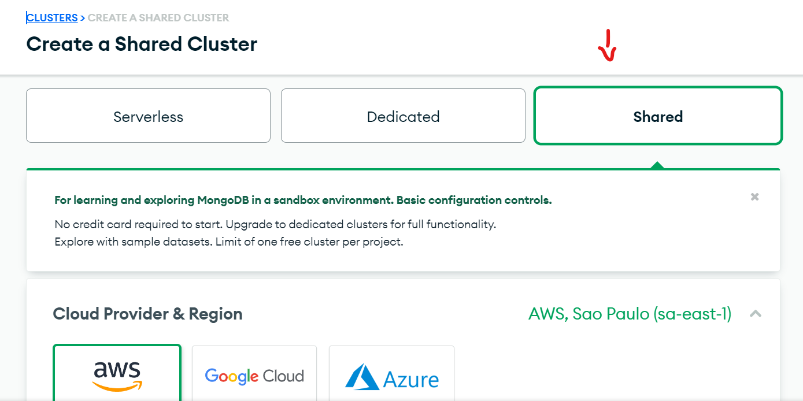
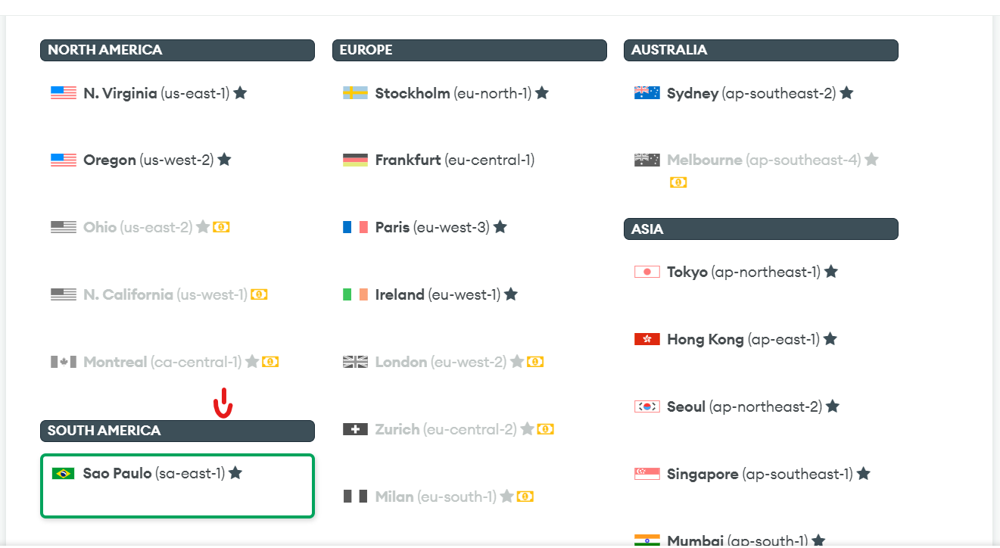
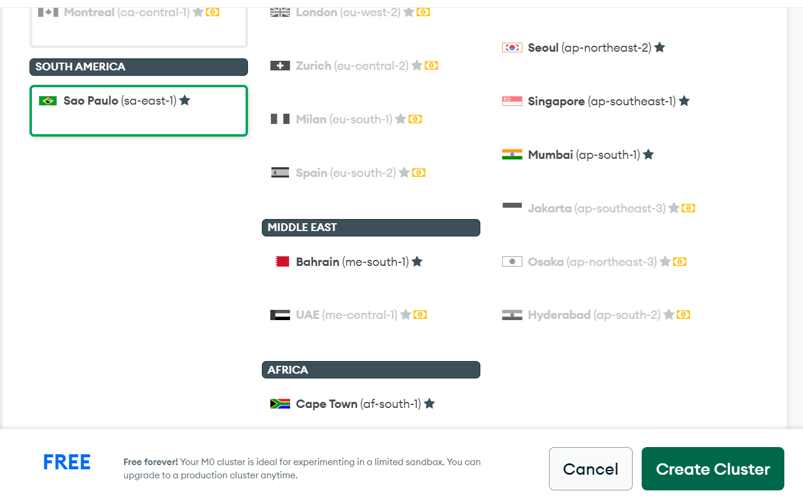
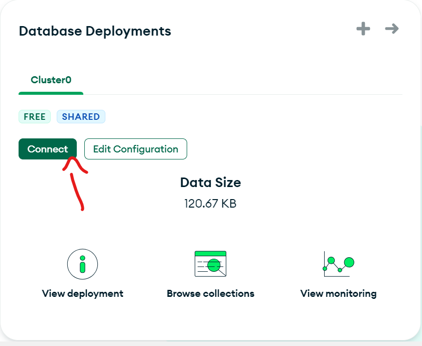
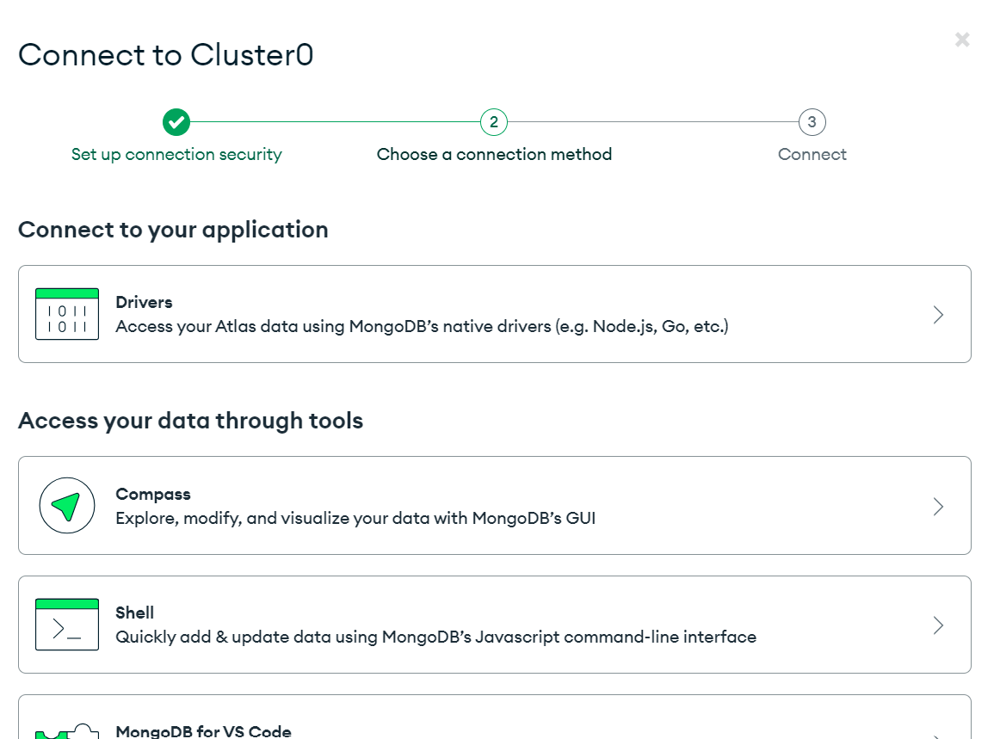
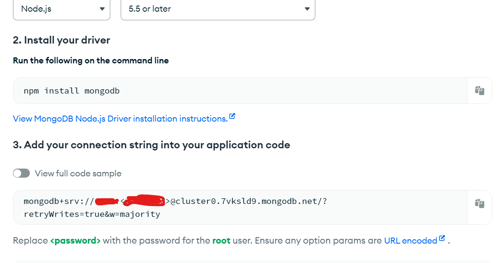

# CHILD REWARDS
Projeto para gestão de recompensas para tarefas de casa de crianças

# Instalação
## Clone
Primeiro clone este repostório em sua máquina
`git clone https://github.com/levymeireles/child-rewards.git`  

Em seguida abra a pasta no seu terminal

Na pasta raiz do projeto execute o comando abaixo para instalar as dependências
`npm install` 

Crie uma conta gratuita no mongoDb e crie um cluster https://www.mongodb.com/pt-br/cloud/atlas/register  
docs: https://www.mongodb.com/docs/v6.0/core/databases-and-collections/

Após criar sua conta vá no menu lateral e acessa a página "Database" então clique em  "+ Create"  
  
Escolha a opção "Shared" para um database gratuito
  
Escolha a localização em que gostaria de ter seu cluster
  
Então clique em "Create Cluster"
  
Irá pedir para criar um usuário e senha, guarde pois usaremos nos próximos passos
Após isso volte para  tela principal e clique em "Connect"
  
Selecione a opção "Drivers"
  
Então aparecerá sua URL de conexão ao seu cluster (usaremos no próximo passo)
  

Após criar seu database, crie um arquivo ".env" na pasta raiz do projeto
e adicione as seguintes variavéis:

PORT=8000  
MONGODB_URL=URL DO SEU CLUSTER (que pegou no passo anterior)  
MONGODB_USERNAME=SEU USERNAME (que criou na criação do cluster)  
MONGODB_PASSWORD=SUA SENHA (que criou na criação do cluster)  

Então vá no terminal novamente e execute o comando 
`npm run start:dev`

No terminal aparecerá a porta onde o servidor está rodando (default: 8000)

então abra seu navegador ou postman ou insomnia e teste como "http://localhost:8000/users"

# Como usar
## API
## Users - Classe responsável em gerenciar o usuário da aplicação (responsável da criança)

```http
  GET /users/
```

| Parâmetros | Tipo     | Descrição                             |
| :--------- | :------- | :------------------------------------ |
| none| none|none

| Return | Descrição|
| :----- | :-----|
| Users[]|lista de usuários|

```http
  POST /users/
```

| Parâmetros | Tipo     | Descrição                             |
| :--------- | :------- | :------------------------------------ |
| name| string |nome do usuário|
| email| string |email do usuário|
| photo| string |foto do usuário|
| password| string |senha do usuário|

| Return | Descrição|
| :----- | :-----|
| Users|Usuário criado|

```http
  PATCH /users/
```

| Parâmetros | Tipo     | Descrição                             |
| :--------- | :------- | :------------------------------------ |
| id| string| id do usuário a ser alterado|
| name?| string| nome do usuário a ser alterado|
| photo?| string| foto do usuário a ser alterado|
| password?| string| senha do usuário a ser alterado|

| Return | Descrição|
| :----- | :-----|
| Users|Usuário alterado|

```http
  DELETE /users/
```

| Parâmetros | Tipo     | Descrição                             |
| :--------- | :------- | :------------------------------------ |
| id| string|id para excluir registro

| Return | Descrição|
| :----- | :-----|
| Users|Usuário deletado|

## Childs - Classe responsável em gerenciar o a criança da aplicação

```http
  GET /childs/
```

| Parâmetros | Tipo     | Descrição                             |
| :--------- | :------- | :------------------------------------ |
| none| none|none

| Return | Descrição|
| :----- | :-----|
| Childs[]|lista de crianças|

```http
  POST /childs/
```

| Parâmetros | Tipo     | Descrição                             |
| :--------- | :------- | :------------------------------------ |
| name| string |nome da criança|
| photo| string |foto da criança|
| points| number |pontos da criança|
| id_user| string |id do usuário responsável|

| Return | Descrição|
| :----- | :-----|
| Child|Criança criada|

```http
  PATCH /childs/
```

| Parâmetros | Tipo     | Descrição                             |
| :--------- | :------- | :------------------------------------ |
| id| string| id da criança a ser alterada|
| name| string |nome da criança|
| photo| string |foto da criança|
| points| number |pontos da criança|
| id_user| string |id do usuário responsável|

| Return | Descrição|
| :----- | :-----|
| Child|Criança alterado|

```http
  DELETE /childs/
```

| Parâmetros | Tipo     | Descrição                             |
| :--------- | :------- | :------------------------------------ |
| id| string|id para excluir registro

| Return | Descrição|
| :----- | :-----|
| Child|Criança deletado|


## Tasks - Classe responsável em gerenciar as tarefas da aplicação

```http
  GET /tasks/
```

| Parâmetros | Tipo     | Descrição                             |
| :--------- | :------- | :------------------------------------ |
| none| none|none

| Return | Descrição|
| :----- | :-----|
| Tasks[]|lista de tarefas|

```http
  POST /tasks/
```

| Parâmetros | Tipo     | Descrição                             |
| :--------- | :------- | :------------------------------------ |
| name| string |nome da tarefa|
| createdDate| string |data da criação|
| startDate| string |data de início|
| endDate| string |data de término|
| interval| int |intervalo de repetição da tarefa|
| done| boolean |se a tarefa foi realizada ou não|

| Return | Descrição|
| :----- | :-----|
| Task|Tarefa criada|

```http
  PATCH /tasks/
```

| Parâmetros | Tipo     | Descrição                             |
| :--------- | :------- | :------------------------------------ |
| id| string| id da tarefa a ser alterada|
| name| string |nome da tarefa a ser alterada|
| createdDate| string |data da criação a ser alterada|
| startDate| string |data de início a ser alterada|
| endDate| string |data de término a ser alterada|
| interval| int |intervalo de repetição da tarefa a ser alterada|
| done| boolean |se a tarefa foi realizada ou não|

| Return | Descrição|
| :----- | :-----|
| Task|Tarefa alterada|

```http
  DELETE /tasks/
```

| Parâmetros | Tipo     | Descrição                             |
| :--------- | :------- | :------------------------------------ |
| id| string|id para excluir registro

| Return | Descrição|
| :----- | :-----|
| Task|Tarefa deletada|


## Rewards - Classe responsável em gerenciar as recompensas da aplicação

```http
  GET /rewards/
```

| Parâmetros | Tipo     | Descrição                             |
| :--------- | :------- | :------------------------------------ |
| none| none|none

| Return | Descrição|
| :----- | :-----|
| Reward[]|lista de recompensas|

```http
  POST /rewards/
```

| Parâmetros | Tipo     | Descrição                             |
| :--------- | :------- | :------------------------------------ |
| name| string |nome da recompensa|
| percentNeeded| number |porcentagem necessária de tarefas realizas para resgatar a recompensa|

| Return | Descrição|
| :----- | :-----|
| Reward|Recompensa criada|

```http
  PATCH /rewards/
```

| Parâmetros | Tipo     | Descrição                             |
| :--------- | :------- | :------------------------------------ |
| id| string| id da recompensa a ser alterada|
| name| string |nome da recompensa a ser alterada|
| percentNeeded| number |porcentagem necessária de tarefas realizas para resgatar a recompensa a ser alterada|

| Return | Descrição|
| :----- | :-----|
| Reward|Recompensa alterada|

```http
  DELETE /rewards/
```

| Parâmetros | Tipo     | Descrição                             |
| :--------- | :------- | :------------------------------------ |
| id| string|id para excluir registro

| Return | Descrição|
| :----- | :-----|
| Reward|Recompensa deletada|


# Tecnologias usadas
- Node.js
- Express
- Estrutura SOLID

# Licença

# Documentação
  
# Contribuições
Não estamos aceitando contribuições no momento.

# Equipe
<table>
  <tr>
    <td align="center"><a href="https://github.com/levymeireles"><br /><sub><b>Levy Meireles</b></sub></a><br /><p>💻</p></td>
    <td align="center"><a href="https://github.com/Gabryel-Santos"><br /><sub><b>Gabryel Meireles</b></sub></a><br /><p>💻📖</p></td>
    <td align="center"><a href="https://github.com/LeonardoSosa"><br /><sub><b>Leonardo Sosa</b></sub></a><br /><p>💻📖</p></td>
    <td align="center"><a href="https://github.com/HugoJSG"><br /><sub><b>Hugo Sosa</b></sub></a><br /><p>📖</p></td>
  </tr>
</table>
